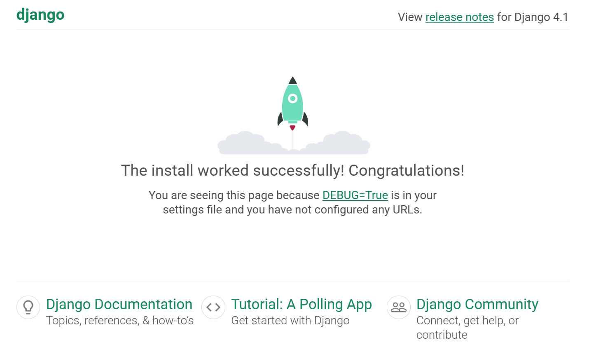
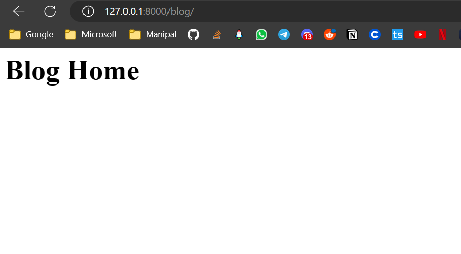

Following corey schafer's youtube series


<br/>
<br/>

# Video-01

<br/>

## Installing django

- Create a virtual environment for the django project and install django using
	```
	pip install django
	```

- Check the django version using 
	```
	python -m django --version
	```

<br/>

## django admin

```
django-admin
```

The above command lists all the available subcommands
```
Available subcommands:

[django]
    check
    compilemessages
    createcachetable
    dbshell
    diffsettings
    dumpdata
    flush
    inspectdb
    loaddata
    makemessages
    makemigrations
    migrate
    optimizemigration
    runserver
    sendtestemail
    shell
    showmigrations
    sqlflush
    sqlmigrate
    sqlsequencereset
    squashmigrations
    startapp
    startproject
    test
    testserver
```


<br/>

## Starting a django project

```
django-admin startproject <name of the project>
```

- For example, we create a django project called `django_project` using 
	```
	django-admin startproject django_project
	```

Now, it'll have a directory created with the name "django_project" with the files as follows:

```
D:.
│   manage.py
│
└───django_project
        asgi.py
        settings.py
        urls.py
        wsgi.py
        __init__.py
```

- asgi.py allows for an optional Asynchronous Server Gateway Interface to be run.
- settings.py controls our Django project’s overall settings.
- urls.py tells Django which pages to build in response to a browser or URL request.
- wsgi.py stands for Web Server Gateway Interface which helps Django serve our eventual web pages.
- __init__.py indicates that the files in the folder are part of a Python package. Without this file, we cannot import files from another directory which we will be doing a lot of in Django!

- The manage.py file is not part of `django_project` but is used to execute various Django commands such as running the local web server or creating a new app.


<br/>

## Running a local server

```
python manage.py runserver
```

It runs a local server at http://127.0.0.1:8000 which is `localhost:8000` and we should see this page :




<br/>
<br/>

# Video-02

<br/>

# Creating App

In a django project we can create multiple apps. This creates modularity.

```
python manage.py startapp <name of the app>
```

Here we are creating a "blog" app in django_project, `python manage.py startapp blog`
Now our tree structure would look like this,

```
Volume serial number is 4297-79C6
D:.
│   db.sqlite3
│   manage.py
│
├───blog
│   │   admin.py
│   │   apps.py
│   │   models.py
│   │   tests.py
│   │   views.py
│   │   __init__.py
│   │
│   └───migrations
│           __init__.py
│
└───django_project
    │   asgi.py
    │   settings.py
    │   urls.py
    │   wsgi.py
    │   __init__.py
```

<br/>


## Creating Views

views.py file present in our app handles the views.

```python
#views.py

from django.shortcuts import render
from django.http import HttpResponse

def home(response):
    """This is the Home page for our blog app."""
    return HttpResponse('<h1>Blog Home</h1>')

```

Create a `urls.py` in blog directory (not to be confused with urls.py present in the django_project \[project level\] ) and add the code :
```python
#urls.py present in blog
from django.urls import path
from . import views

urlpatterns = [
    path('', views.home, name = 'blog-home'),
]
```
This module routing inside the `blog` app. Here, we are importing the views module to get the `home` function. Therefore whenever we access the blog app, a home view can be seen. The empty string in path function is explained down.


Now we have to make changes in the `urls.py` present in project level i.e. `django_project` as follows:
```python
#urls.py present in django_project
from django.contrib import admin
from django.urls import path, include  #New


urlpatterns = [
    path('admin/', admin.site.urls),
    path('blog/',include('blog.urls'))   #New
]
```
the  `path('blog/',include('blog.urls'))` routes the `blog/` to the `urls.py` present in `blog` app, we use `include` function for this.


> the path() in urls.py present in django_project processes everything until blog/ and returns the remaining to the path() present in blog. Since there is nothing after blog/ in n urls.py present in django_project, we have empty string '' in path() present in blog!


When we run the local server and hit localhost:8000/blog we must see,



