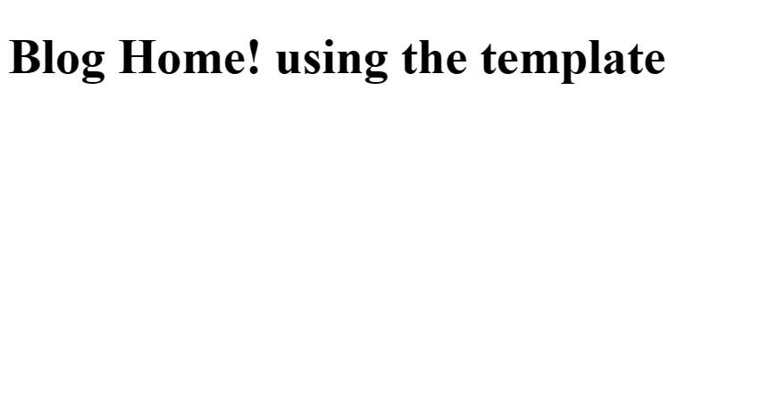
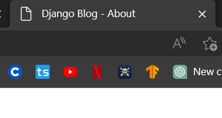

<br/>

## Templates
---
- django looks for templates in all installed apps.
- We create a `templates` directory in our `blog` app directory.
- Since we can clearly that this template is specific to blog app, we have to create a directory with the same name as the app,`blog` for this case. (django convention!)
- We can create html templates for our blog app inside this directory, here we create home.html and about.html
- Our tree should look like
	```
	D:.
	│   manage.py
	│
	├───blog
	│   │   admin.py
	│   │   apps.py
	│   │   models.py
	│   │   tests.py
	│   │   urls.py
	│   │   views.py
	│   │   __init__.py
	│   │
	│   ├───templates
	│   │   └───blog
	│   │           about.html
	│   │           home.html
	```

Now we have to route :
```python
#apps.py in blog dir
from django.apps import AppConfig


class BlogConfig(AppConfig):
    default_auto_field = 'django.db.models.BigAutoField'
    name = 'blog'

```
	We copy  the `BlogConfig` and use it as '\'blog.apps.BlogConfig\'' in INSTALLED_APPS list present in `settings.py` of django_project dir

```python
#settings.py in django_project dir
...

# Application definition

INSTALLED_APPS = [
    'blog.apps.BlogConfig',  #new
    'django.contrib.admin',
    'django.contrib.auth',
    'django.contrib.contenttypes',
    'django.contrib.sessions',
    'django.contrib.messages',
    'django.contrib.staticfiles',
]
...
```


the home.html contains the necessary html code 
```html
<!DOCTYPE html>

<html>
    <head>
        <title> </title>
    </head>

<body>
    <h1> Blog Home! using the template</h1>
</body>
</html>
```

Now we accommodate the template in our views.py module. We make use of the render function from django.shortcuts

```python
#views.py 

from django.shortcuts import render
from django.http import HttpResponse

def home(request):
    """This is the Home page for our blog app."""
    #return HttpResponse('<h1>Blog Home</h1>')
    return render(request, 'blog/home.html')       #New

def about(request):
    """This is the About page for our blog app."""
    #return HttpResponse('<h1>This is About me</h1>')
```

When we run our local server and head to localhost:8000/blog we must now see



We can do similar thing for blog/about using about.html.

<br/>

## Using dictionary data as variables and adding control statements in html
---
```python
#views.py in blog

from django.shortcuts import render
from django.http import HttpResponse


#New
posts = [
    {
        'author': 'Some Dude',
        'title': 'Blog Post 1',
        'content': 'First post content',
        'date_posted': 'August 2022'
    },
    {
        'author': 'Some Other Dude',
        'title': 'Blog Post 2',
        'content': 'Seconf post content',
        'date_posted': 'August 2023'
        
    }
]


def home(request):
    """This is the Home page for our blog app."""

    context = {                                         #New
        'post_key': posts
    }
    return render(request, 'blog/home.html', context)   #New

def about(request):
    """This is the About page for our blog app."""
    
    return render(request, 'blog/about.html')

```
Here we have created a list of posts containing data in the form of dicts. We have used that list in the context variable dict and passed that as third parameter in render().

```html
<!DOCTYPE html>

<html>
    <head>
        <title> </title>
    </head>

<body>
    
        <h1> {{post.title}}</h1>
        <p> By {{post.author}} on {{post.date_posted}}</p>
        <p> {{post.content}}</p>
    
</body>
</html>
```
Now the data passed as context can be used in home.html.
-  : syntax for for, if loops.
- {{ }} : To refer a variable
- post.title, post.author... all these are different non python way of referencing!

<br/>

## Passing titles
---
We can pass the title for the web page from the views.py. We modify the about function in views.py as follows:
```python
def about(request):
    """This is the About page for our blog app."""
    
    return render(request, 'blog/about.html', {'title': "About"})  #passing a title as a dict
```

We can use this accordingly in about.html as
```html
<!DOCTYPE html>

<html>
    <head>
        
            <title>Django Blog - {{title}} </title>
        
            <title>Django Blog </title>
        
    </head>

<body>
    <h1> Blog About! using the template</h1>
</body>
</html>
```

Now if we head to localhost:8000/blog/about, we see this on the tab



<br/>

Similarly we have modified the home.html as shown here

```html
<!DOCTYPE html>

<html>
    <head>
        
            <title>Django Blog - {{title}} </title>
        
            <title>Django Blog </title>
        
    </head>

<body>
    
        <h1> {{post.title}}</h1>
        <p> By {{post.author}} on {{post.date_posted}}</p>
        <p> {{post.content}}</p>
    
</body>
</html>
```


<br/>
<br/>


## Template Inheritance
---
There is repeated code in our html files, we need to follow DRY principle, hence we use template inheritance.
- We create a new html file in blog/templates/blog/ dir called `base.html`, This should contain all the repeated code (i.e. code that other html files are going to be inheriting) and a` ` so that unique things in the html files will be wrapped as content
```html
<!DOCTYPE html>

<html>
    <head>
        
            <title>Django Blog - {{title}} </title>
        
            <title>Django Blog </title>
        
    </head>

<body>
    
</body>
</html>
```

Now our home.html and about.html should be modified to use the base.html, The home.html will look like
```html



    
        <h1> {{post.title}}</h1>
        <p> By {{post.author}} on {{post.date_posted}}</p>
        <p> {{post.content}}</p>
    

```
- Here the `` will inherit the code from the base.html file (The repeated code) and the unique code is wrapped in this way
	```
	
	...
	
	```

Similarly, the about.html file is
```html



    <h1> Blog About! using the template</h1>

    
```


<br/>
<br/>

## Using bootstrap for styling
---
We use the starter template from [Introduction · Bootstrap (getbootstrap.com)](https://getbootstrap.com/docs/4.3/getting-started/introduction/) directly

```html
<!doctype html>
<html lang="en">
  <head>
    <!-- Required meta tags -->
    <meta charset="utf-8">
    <meta name="viewport" content="width=device-width, initial-scale=1, shrink-to-fit=no">

    <!-- Bootstrap CSS -->
    <link rel="stylesheet" href="https://cdn.jsdelivr.net/npm/bootstrap@4.3.1/dist/css/bootstrap.min.css" integrity="sha384-ggOyR0iXCbMQv3Xipma34MD+dH/1fQ784/j6cY/iJTQUOhcWr7x9JvoRxT2MZw1T" crossorigin="anonymous">

    <title>Hello, world!</title>
  </head>
  <body>
    <h1>Hello, world!</h1>

    <!-- Optional JavaScript -->
    <!-- jQuery first, then Popper.js, then Bootstrap JS -->
    <script src="https://code.jquery.com/jquery-3.3.1.slim.min.js" integrity="sha384-q8i/X+965DzO0rT7abK41JStQIAqVgRVzpbzo5smXKp4YfRvH+8abtTE1Pi6jizo" crossorigin="anonymous"></script>
    <script src="https://cdn.jsdelivr.net/npm/popper.js@1.14.7/dist/umd/popper.min.js" integrity="sha384-UO2eT0CpHqdSJQ6hJty5KVphtPhzWj9WO1clHTMGa3JDZwrnQq4sF86dIHNDz0W1" crossorigin="anonymous"></script>
    <script src="https://cdn.jsdelivr.net/npm/bootstrap@4.3.1/dist/js/bootstrap.min.js" integrity="sha384-JjSmVgyd0p3pXB1rRibZUAYoIIy6OrQ6VrjIEaFf/nJGzIxFDsf4x0xIM+B07jRM" crossorigin="anonymous"></script>
  </body>
</html>
```

