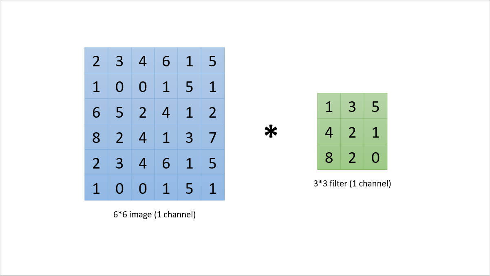
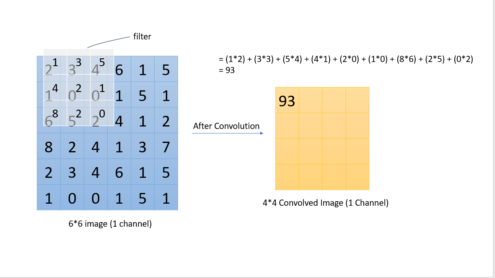

# Computer Vision Problems

1. Image Classification
2. Object Detection
3. Neural Style Transfer

<br>
<br>
<br>

# Input Features

- for an image of size m\*n and z channels, **the number of input features would be m\*n\*z**.

<br>
<br>
<br>

# Convolution Operation

- Place the filter on top the image and start multiplying the cell values accordingly and then compute the addition of all the products. (see the illustrative images below)

  
  

<br>

> <br> If the size of the image is n\*n and the size of the filter is f\*f then the size of the convolved (image after convolution) is n-f+1. (this is with no padding and strides! checkout the sophesticated formula down) <br> <br>

<br>
<br>

## Vertical Edge Detector

- When the convolution operation is performed using the below filter(kernal), it extracts vertical edges from the image. The reason is math (multiplication, addition and subtraction), we can take a simple 2D matrix and intuitively understand where the convolved values will give bright values (non zero) and pulls out vertical edges.

  ```
  | 1 | 0 | -1|
  | 1 | 0 | -1|
  | 1 | 0 | -1|
  ```

<br>
<br>

## Padding

- _Padding refers to the process of adding extra surrounding pixels (zero or non zero values) to the input data before applying the convolution operation._
- Convolution can be performed with padding, known as **valid convolution** or without padding, known as **same convolution**.
- Why do we need padding?
  1. Every time the convolution is performed, we observe that the size of the convolved image is decreasing. Performing convolution many times would result in an image which is very small in size. (padding solves this, we get the convolved image of same size)
  2. If we see carefully, we see that the pixels in the middle of the image are used many times by the filter for convolution when compared to boundary pixels, which are used only once.

> add the image with the equation showing the padding size based on the size of the filter

<br>
<br>

## Stride

- _stride refers to the step size at which the convolutional filter moves over the input data or feature maps during the convolution operation._

> Add the image containing the formula.

```
- If,

  - n, is the size of the image
  - f, is the size of the filter
  - p, is the size of the padding
  - s, is the size of the stride

  - then the size of the convolved image will be floor((n + 2p - f)/s +1)
```

<br>
<br>

## Technical Note on cross-correlation vs convolution

- In Math and Signal Processing, convolution is carried out by initially flipping all the values of the filter (horizontally and vertically). This is convolution.
- What we call convolution in deep learning is actually cross-correlation, but it has been a convention to call it convolution.
- The flipping helps the associativity property (A*B)*C = A*(B*C) but this is of no use in deep learning, hence we avoid the flipping (or mirroring)

> Add Image

<br>
<br>
<br>

# Convolution over volume

- Images we deal are generally RGB which contain 3 channels.

> <br>
> - The number of channels in the filter must equal to number of channels in the image.  <br> 
> - The output image after convolution of RBG images (3 channel) with 3 channel filter will result in a 1 channel image (and not 3 channel!) <br> <br>

> Add image for illustration

<br>
<br>
<br>

# Convolution with multiple filters

- When performed with multiple filters, the resulting convolved images are stacked. Hence if a RGB image is convolved with two 3 channel filters then the output convolved image will have 2 channels (1 for each filter).

- The equations, including the number of channels will be

> Add the equation

<br>
<br>
<br>

# One Layer of Convolution Network

> Add the image and illustration

### Q

- If we have 10 filters that are 3*3*3 in one layer of a neural network, how many parameters does that layer have.

  - The number of features = number of filters = 10
  - The number of parameters = ( number of cells in the filter (including all channel) + bias ) * number of filters = ((3*3*3) + 1) * 10 = 280 paramters.

- Notice that the number of paramters is not dependent on the dimensions of the input image but only the dimensions and the number of filters. Hence a 64*64*3 image will have the same number of parameters when the same filters are used on say a 1080*1080*3 image.

<br>
<br>
<br>

# Pooling layers

> Add image and illustration

- Note that there are no parameters to train in the pooling layers, we set the hyperparameters and they are fixed.

```

```
