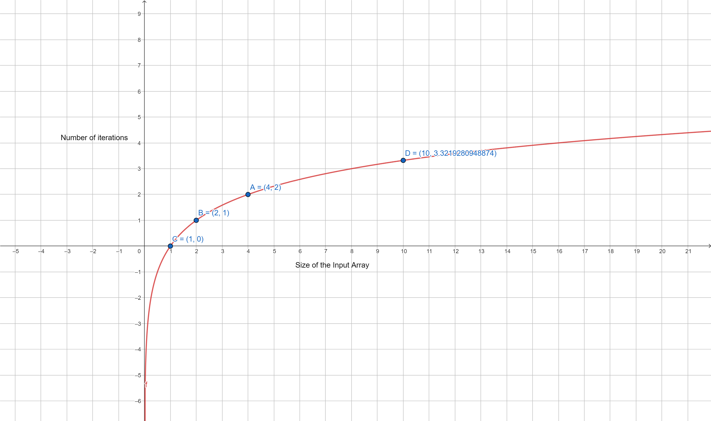

# Complexity

### Why halving algorithms have logarithmic runtime

if y is halving for every step increase in x then the relation would be $y=1/2^x$ and the curve would look like below. The confusion lies in the quantities we are measuring.

- In the case of the algorithm, The quantities are the size of the input array _for every iteration of the algorithm_ and the number of iterations.

  - If an algorithm halves the input array's size in every successive iteration, the size of the array in each iteration is equal to $N\times{1/2^x}$, where $N$ is the size of the array at every iteration and $x$ is the number of iteration.
  - For illustration (see graph) if the size of input array is 10, after 1st iteration the size will be halved i.e. 5, after 2nd iteration it'll be 2.5, after 3rd iteration it'll be 1.25 and after 3.3 iterations it'll be 1.
  - 

- However when we are speaking of complexity (specifically time), The quantities are size of the input array itself and the number of iterations.

  - If an input array of size N is used in an algorithm that halves it in every iteration, then the number of iterations it takes to reach a point where no more halvings can be made is equal to $\log_2(N)$ [proof](#proof). Hence we say that the time complexity grows logarithmically.
  - For illustration (see graph) if an array of size 10 is used in an algorithm that halves it in every iteration, then it takes $\log_2(10)=3.3$ number of iterations to reach a point where further halving cannot be made further.

    

#### proof

The decreasing sizes are $N, N/2, N/4,...N_k$ which can be written as $N/2^0, N/2^1, N/2^2,...N/2^k$, where N is the size of the input array, k is the number of iterations and each term is the size of the array at k'th iteration. Since the final size of the array must be 1 (at that point no further halving can be done). We can write the equation as follows:

$$ N_k = N/2^k = 1$$

Solving for number of iterations, i.e. k

$$ k = \log_2(N)$$
