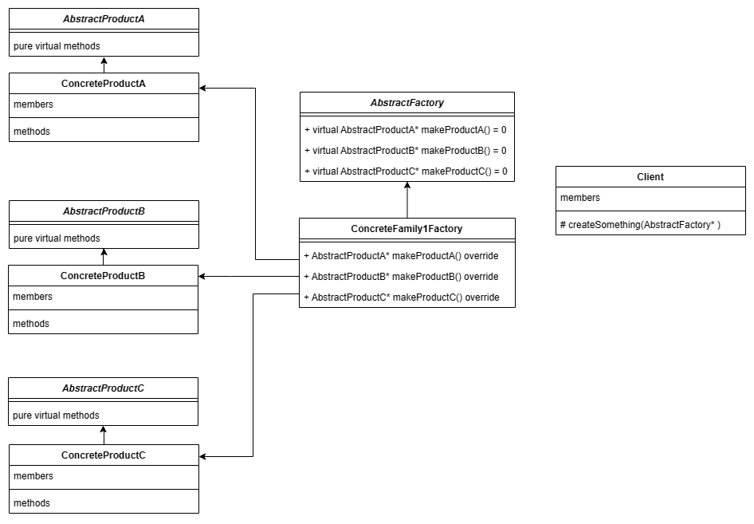
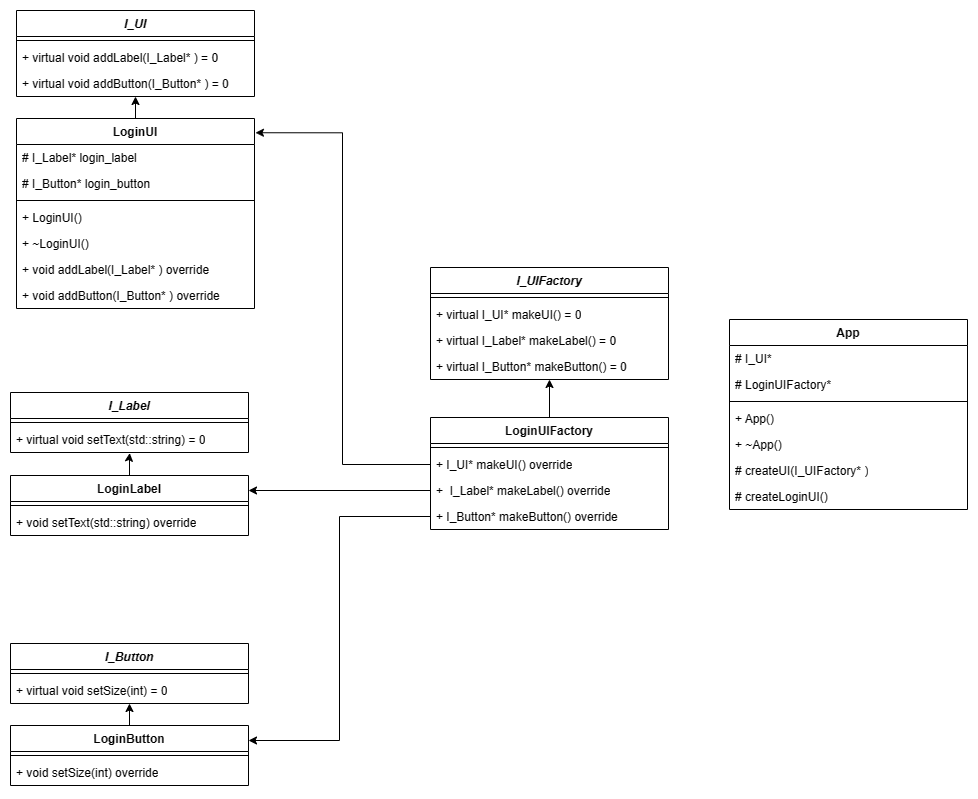

# Abstract Factory Pattern

**_The Abstract Factory design pattern is a creational pattern that helps creation of families of related objects without specifying their concrete classes._**

- Key Components are as follows :
    <ol type="1">
        <li>  Abstract Factory: An interface defining the operations creating each product in the family. </li>
        <li> Concrete Factories: Implementations of the Abstract Factory that create specific concrete products related to their family.</li>
        <li> Products: Concrete class implementations of the abstract products defined by the interface. </li>
    </ol>

- The UML diagram for the pattern :

  

- Applicability:

  - A system should be independent of how its products are created, composed, and represented
  - A system should be configured with one of multiple families of products
  - A family of related product objects is designed to be used together, and you need to enforce this constraint.

- Advantages :

  - Client is Independent as it is isolated from product implementation. (Decoupling client and implementation logic)
  - Class library of products,are revealed just by their interfaces, not their implementations.
  - Supports new Family (Given it has the name number and type of products in it)
  - Promotes consistency among products.

- Consequences :
  - Creates lot of classes in the process, thus hindering code readability.
  - Supporting new kinds of products is difficult.

<br>
<br>

## Illustration

- The UML diagram for an example

  

- `ILabel` : Abstract class defines the interface for labels, ensuring consistent interaction and behavior across UIs.
- `IButton` : Abstract class defines the interface for buttons,ensuring consistent interaction and behavior across UIs.
- `IWidgetFactory` : Abstract class defines the interface for the WidgetFactory, which will create the UI respective widgets.

  ```cpp
  #include <iostream>

  //This is Abstract class for Label
  class ILabel {
  public:
      virtual void showText() = 0;
  };

  //Concrete class of ILabel, for Login UI
  class LoginLabel : public ILabel {
      void showText() override {
          std::cout << "Already a user? Click to log in" << std::endl;
      }
  };

  //Concrete class of ILabel, for Signup UI
  class SignupLabel : public ILabel {
      void showText() override {
          std::cout << "Not a user? Click to sign up" << std::endl;
      }
  };


  //Abstract class for Button
  class IButton {
  public:
      virtual void click() = 0;
  };

  //Concrete class of IButton, for Login UI
  class LoginButton : public IButton {
      void click() override {
          std::cout << "Login Button is clicked." << std::endl;
      }
  };

  //Concrete class of IButton, for Signup UI
  class SignupButton : public IButton {
      void click() override {
          std::cout << "Signup Button is clicked" << std::endl;
      }
  };


  //This is Abstract Factory
  class IWidgetFactory {
  public:
      virtual ILabel* createLabel() = 0;
      virtual IButton* createButton() = 0;
  };

  //This is Concrete Factory
  class LoginWidgetFactory : public IWidgetFactory {
  public:
      ILabel* createLabel() {
          return new LoginLabel();
      }
      IButton* createButton() {
          return new LoginButton();
      }
  };

  //This is Concrete Factory
  class SignupWidgetFactory : public IWidgetFactory {
  public:
      ILabel* createLabel() {
          return new SignupLabel();
      }
      IButton* createButton() {
          return new SignupButton();
      }
  };


  int main() {
      //Assuming the client wants to render Login UI now; It has a label and a button;
      IWidgetFactory* login_widget_factory = new LoginWidgetFactory();

      ILabel* login_label = login_widget_factory->createLabel();
      IButton* login_btn = login_widget_factory->createButton();

      login_label->showText();
      login_btn->click();
  }

  //Already a user ? Click to log in
  //Login Button is clicked.
  ```

- Applicability :

  - Client must configure either of two _Families_ of UI, Login UI and Signup UI which have two _Products_, Label and Button.
  - Family of related products are designed to work together.

- Advantages :

  - Client is independent as it is isolated from the type of products (i.e. widgets: label and button) created.
  - Products are facilitated as interfaces and implementation is not exposed.
  - We can support a new family (say a Logout UI), by creating a new concrete widget factory. (given the new family also has the same number and type of products)

- Disadvantages :

  - Creates lot of classes, Thus hindering code readability.
  - Supporting new products with the same code is not possible because we have to modify the `IWidgetFactory`. The idea of creating new abstract class for the new product will not work, because we have to now modify the `IWidgetFactory` class, if we make the creation of new product as pure virtual function, then the already existing `LoginWidgetFactory` and `SignupWidgetFactory` will break. If we make the creation of the new product as plain virtual function, then we have to write implementation for it, which we cannot.

      <br>

    ```cpp
    //say we created Ipopup and LogoutPopup
    class IWidgetFactory {
    public:
        virtual ILabel* createLabel() = 0;
        virtual IButton* createButton() = 0;
        virtual IPopup* createPopUp(){} // We cannot provide implementation here as we cannot return the IPopup*.
    };
    ```
