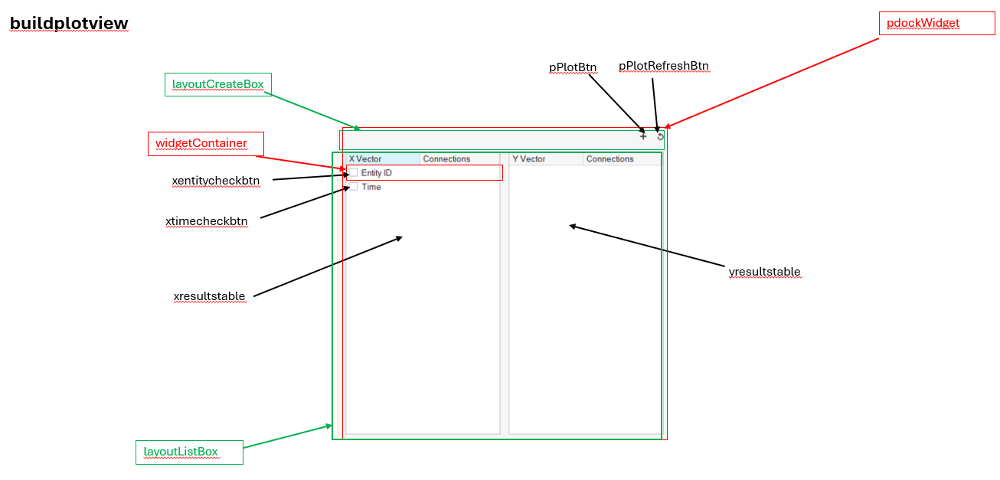

## Responsibility of the Function

When unsure where exactly to place a piece of code, **_always consider the name of the function which should translate its responsibilities_**. This will help you decide the most appropriate location for the code.

 
 

## Single Return vs Multiple Return

The case for function with multiple return statements:

- Less code to write as there is no need to create local variables.
- One might find the control flow better with early returns.

Although **_it is better to write functions with single return statements_**, because

- In a scenario of updating an existing function, if the function has multiple return points, there is uncertainity that the newly added code will get executed as there can be an early return. In the other case, the single return point is precisely known.
- In scenarios dealing with memory, writing code dealing with memory (example: memory clean up code) is much easier if the function has single return point.

 
 

## UI development

It is best to create documentation where the names with respect to code (variable and function names) are included pictorially. This will be really helpful to quickly navigate through the code base.

- Example: Lets say the behaviour of a button click is broken, if the pictorial documentation has the name of the variable for that button, then any dev can quickly navigate to that button and check it's behaviour rather than finding that button by reading a lot of code.
