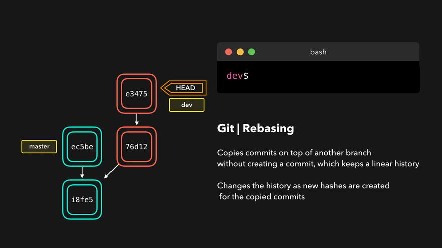

# Git Merging

Merging refers to the process of incorporating the changes made in one branch into another.

- Being in the branch where another branch has to be merged, The following command must be used with the name of the branch to be merged into the current branch.

  ```
  git merge <branch-name> #the mentioned branch will be merged into the current branch
  ```

<br>
<br>

## Types of merges

<br>

### Fast Forward Merge


<br>

### Merge Commit


<br>

### Squash Merge

<br>

### Rebase



<br>

Follow these steps to rebase a current branch (ex: feature) to target branch (ex: main):

1. Make sure to be in the branch that needs to be rebased to the target branch.

   ```bash
   git switch <current-branch-name> #git switch feature1.2
   ```

1. Use the following command to rebase the current branch to the target branch.

   ```bash
   git rebase <target-branch> #git rebase main
   ```

1. If any merge conflicts occur, resolve them like resolving any other merge conflict.

> See merge notes below

<br>
<br>

## Merge Conflicts

- Merge conflicts occur when git is unable to automatically combine changes from different branches due to conflicting modifications in the same part of a file or conflicting changes in file renames or deletions.

  

- It is ideal to use an external merge tool to resolve merge conflicts. VS code's latest three way merge editor looks nice. Set it in the .gitconfig as shown in customizations file.

<br>

### Resolving merge conflicts using merge tool

Follow these steps when merge conflict occurs:

1. Launch the mergetool using the git command:

   ```bash
   git mergetool
   ```

2. Resolve the conflict in the merge tool editor and save (Ctrl + S) the tab.
3. Finish the merging by commiting.
   ```bash
   git commit -m "appropriate commit message"
   ```

<br>

### Resolving merge conflicts without merge tool

Follow these steps when merge conflict occurs:

1. Resolve the merge conflict manually.
1. Stage the appropriate files.
   ```bash
   git add <file(s)>
   ```
1. Finish the merging by commiting.

   ```bash
   git commit -m "appropriate commit message"
   ```

<br>
<br>

## Abort a merge

- Ongoing merge process can be aborted using this command.
  ```bash
  git merge --abort
  ```

<br>
<br>

## Undoing a merge

> See this in undoing notes

<br>
<br>

## References

- The gifs are taken from [lydia](https://dev.to/lydiahallie/cs-visualized-useful-git-commands-37p1)
